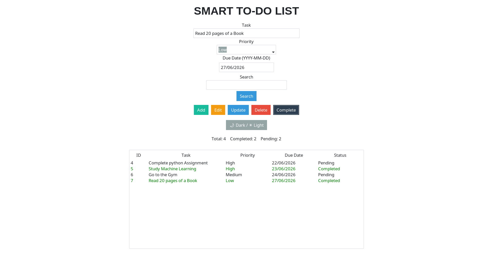
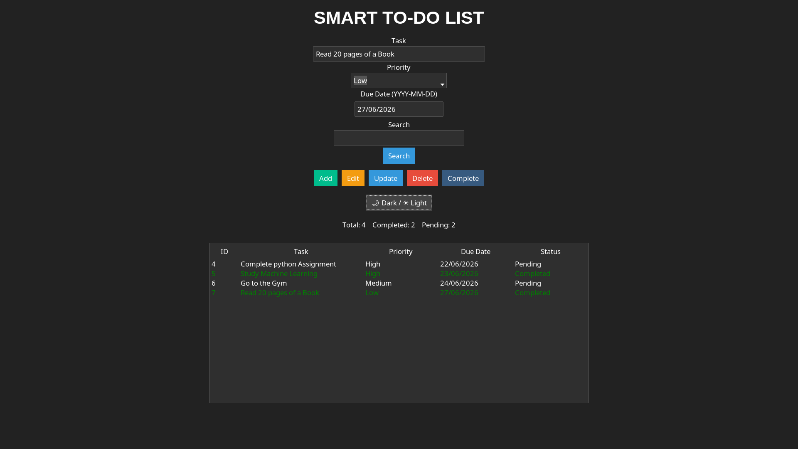

# Smart To-Do List

A desktop To-Do List application built using Python, Tkinter, ttkbootstrap and SQLite.

## Features

- Add Tasks
- Edit Tasks
- Delete Tasks
- Mark Tasks as Completed
- Search Tasks
- Dark / Light Mode
- Task Statistics
- SQLite Database

## Technologies Used

- Python
- Tkinter
- ttkbootstrap
- SQLite

## Project Structure

- main.py → Start the application
- ui.py → User Interface
- database.py → Database operations
- README.md → Project documentation

## Screenshots

### Main Window

### Dark Mode

## Author

Nada Mohammad